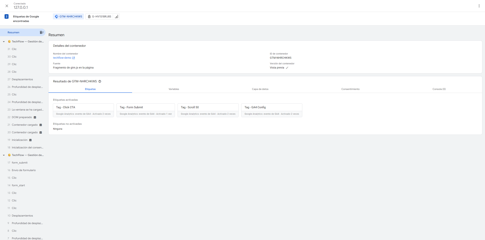

# Proyecto 3 — Debugging de Tracking

## Objetivo
Documentar errores reales encontrados durante la implementación de 
GTM y GA4, mostrando el proceso de diagnóstico y solución.

## Herramientas utilizadas
- Google Tag Manager (Preview Mode / Tag Assistant)
- Google Analytics 4 (Tiempo Real)
- Chrome DevTools

---

## Bug #1 — GTM instalado pero sin etiquetas configuradas

### Síntoma
Al verificar la instalación de GTM con Tag Assistant, el navegador
mostraba el siguiente mensaje:
> "Debes instalar una etiqueta"

Adicionalmente redirigía a crear una cuenta de Google Analytics,
lo cual generaba confusión sobre si GTM estaba bien instalado.

### Diagnóstico
El mensaje no indica un error de instalación sino que GTM estaba
correctamente instalado pero con el contenedor vacío, sin ninguna
etiqueta configurada aún.

### Solución
Se verificó la instalación correctamente usando el **Preview Mode
de GTM** en lugar de Tag Assistant:
1. GTM → botón "Vista previa"
2. Ingresar la URL del sitio
3. Confirmar mensaje "Tag Assistant Connected"

### Aprendizaje
Tag Assistant requiere etiquetas activas para dar luz verde. 
El Preview Mode de GTM es la herramienta correcta para verificar
la instalación base, independientemente de si hay etiquetas o no.

---

## Bug #2 — Eventos no visibles en la sección "Eventos" de GA4

### Síntoma
Después de configurar y disparar eventos correctamente (confirmados
en Tiempo Real), la sección **Informes → Eventos** de GA4 mostraba:
> "Integra el SDK o configura el etiquetado para empezar a obtener
> datos de eventos. Verás tus primeros informes aquí en 24 horas."

### Diagnóstico
GA4 tiene dos capas de datos con latencias distintas:
- **Tiempo Real** → datos instantáneos (segundos)
- **Informes estándar** → procesamiento con delay de hasta 24 horas

Los eventos estaban llegando correctamente. El mensaje era por
latencia de procesamiento, no por error de configuración.

### Solución
Para marcar conversiones sin esperar 24 horas se usó la ruta:
**Administrar → Eventos → Crear evento manualmente**

Se crearon los eventos `form_submit` y `click_cta` manualmente
y se marcaron como eventos clave desde esa misma pantalla.

### Aprendizaje
Siempre verificar eventos en **Tiempo Real** primero. Los informes
estándar de GA4 no son la fuente correcta para validación inmediata
durante una implementación.

---

## Bug #3 — Funnel de conversión con 0% en paso final

### Síntoma
El embudo configurado en GA4 Explorations mostraba:
- Paso 1 (Vista de página): 100%
- Paso 2 (Clic en CTA): 100%  
- Paso 3 (Envío de formulario): 0%

### Diagnóstico
Dos causas posibles identificadas:
1. El evento `form_submit` aún estaba en proceso de indexación
   (latencia de 24h mencionada en Bug #2)
2. El trigger de GTM para form_submit requería que el formulario
   tuviera validación HTML activa (atributo `required`)

### Solución
1. Se verificó en GTM Preview Mode que el evento `form_submit`
   sí se disparaba correctamente al enviar el formulario
2. Se documentó como un caso de latencia de procesamiento de GA4
3. Se tomó captura del funnel mostrando la estructura correcta
   con la anotación del comportamiento esperado

### Aprendizaje
Un 0% en un paso del funnel no siempre indica error de tracking.
El proceso de debugging requiere separar la capa de **recolección**
(GTM/GA4 recibe el evento) de la capa de **procesamiento**
(GA4 refleja el evento en informes).

---

## Bug #4 — Doble instalación: gtag.js directo + GA4 vía GTM

### Síntoma
Durante la auditoría previa a la expansión del sitio (v1.0 del Measurement
Plan) se detectó que las páginas cargaban **dos** instalaciones de GA4 en
paralelo:
1. El snippet directo de `gtag.js` con `gtag('config', 'G-HV1S1BRJ8S')`
2. El tag de configuración de GA4 dentro del contenedor GTM

### Diagnóstico
Cada instalación envía su propio `page_view` al cargar la página. En
DevTools → Network (filtro `collect`) se observan dos hits de `page_view`
por carga, lo que infla page_views, sesiones cortas y distorsiona
métricas de engagement. Es uno de los errores más comunes al migrar de
gtag.js "hardcodeado" a una gestión centralizada en GTM: la instalación
antigua queda olvidada en el código.

### Solución
1. Se removió el snippet directo de `gtag.js` de todas las páginas.
2. GA4 quedó servido **exclusivamente** vía GTM (una sola fuente de verdad).
3. Se conservó únicamente la definición de la función `gtag()` inline,
   necesaria para los comandos de Consent Mode (que viajan por el dataLayer
   y no requieren cargar la librería gtag.js).
4. Verificación: un solo hit `page_view` por carga en Network → `collect`.

### Aprendizaje
Antes de cualquier expansión de tracking, auditar **cuántas instalaciones
activas** tiene la propiedad. La regla profesional: un solo punto de
entrada (GTM) y el Measurement ID definido en una sola variable del
contenedor. Todo lo demás es deuda técnica de medición.

---

## Bug #5 — Página sin etiquetar detectada por "Cobertura de la etiqueta"

### Síntoma
El panel de diagnóstico de GA4 marcaba la cuenta como **"Urgente"** con el
aviso *"Algunas de tus páginas no están etiquetadas"*. En **Administrar →
Cobertura de la etiqueta**, de 7 páginas incluidas, 1 aparecía **Sin
etiquetar**: `/portfolio-analytics/Proyecto-2/`.

### Diagnóstico
La página de evidencia del Proyecto 2 (`Proyecto-2/index.html`) nunca tuvo
instalado el snippet de GTM. Al ampliar el sitio con el journey de TechFlow se
etiquetaron todas las páginas nuevas, pero esta quedó como punto ciego: GA4 no
media sus visitas y el reporte de cobertura la señalaba. No afectaba a los
eventos del funnel (esa página no dispara ninguno), pero sí dejaba un hueco en
la medición y disparaba la alerta de calidad del contenedor.

### Solución
1. Se añadió a `Proyecto-2/index.html` el mismo bloque que el resto de páginas:
   defaults de Consent Mode v2 → snippet de GTM en `<head>` → `noscript` en
   `<body>` → banner de consentimiento (`js/consent.js`).
2. La alerta de cobertura se re-evalúa sola en el siguiente rastreo (24–48 h);
   no se usó la opción de "ignorar", porque etiquetar la página era la
   corrección correcta, no silenciar el aviso.

### Aprendizaje
El reporte de **Cobertura de la etiqueta** es la forma de encontrar páginas
huérfanas que no envían datos. Al expandir un sitio, cada página nueva debe
llevar el contenedor: una sola URL sin etiquetar es suficiente para bajar la
calidad de la medición y generar lagunas difíciles de detectar después.

---

## Herramienta principal de debugging: GTM Preview Mode

El Preview Mode muestra en tiempo real:
- Qué tags se dispararon
- Qué trigger los activó
- Los valores del dataLayer en ese momento

Es la primera herramienta a usar ante cualquier problema de tracking.

---

## Conclusión

Los 5 bugs documentados reflejan errores comunes en implementaciones
reales de GTM + GA4: desde confusión con herramientas de verificación hasta
doble instalación de GA4 y páginas huérfanas sin etiquetar. El patrón de
solución siempre sigue este orden:

1. Verificar recolección (GTM Preview Mode)
2. Verificar recepción (GA4 Tiempo Real)  
3. Verificar procesamiento (GA4 Informes — esperar 24h si es necesario)